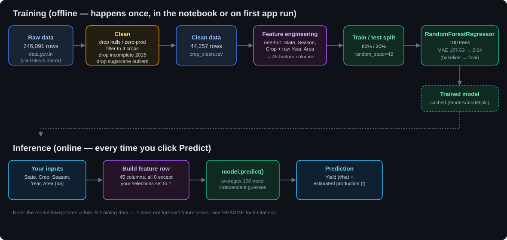

# Crop Yield Predictor

**[Live demo](https://crop-yield-prediction-wpnuufdz2fc9tmbm4k8t3y.streamlit.app/)** — note: the first person to open it on a fresh deploy will see a 1-2 minute training step (the model isn't checked into the repo, see [Running it](#running-it) below).

A portfolio project that predicts crop yield (tonnes per hectare) for four Indian crops — Rice, Wheat, Maize, and Sugarcane — given state, season, year, and planted area.

**This is not a forecasting tool and not production software.** It interpolates within the range of its training data; it does not predict the future. Its value is as evidence of a data-cleaning and modelling process, not as something you'd use to plan a harvest. A pivot table over the same cleaned data would approximate a lot of what this does — what the model adds is generalizing to state/crop/season combinations absent from the training rows, with error measured on held-out data.

## Data

> **Updated to 1997–2022.** The app now trains on newer official data covering 26 years instead of 18. The cleaning and modelling below describe the original analysis on the 1997–2014 file; see [Data update](#data-update-19972022) for what changed and the new results.

Source: [data.gov.in](https://data.gov.in) — "District-wise, season-wise crop production statistics from 1997."

The data.gov.in portal blocks automated downloads, so the raw file here was obtained via a GitHub mirror ([`Aliabdurahman/Prediction-of-crop-Production-in-India`](https://github.com/Aliabdurahman/Prediction-of-crop-Production-in-India)). Its contents match the official dataset description, but byte-identity with the original portal file is unverified.

Raw shape: 246,091 rows × 7 columns (`State_Name, District_Name, Crop_Year, Season, Crop, Area, Production`). Area is in hectares and Production in tonnes — for most crops (see below).

`data/rainfall.csv` (subdivision-level annual rainfall) is included but not yet used in the model. Joining it in is the single biggest planned accuracy improvement.

## Cleaning

Applied in order, each for a specific reason:

1. Derived `Yield = Production / Area`, since predicting `Production` directly would mostly learn "big area → big output," not agronomy.
2. Dropped 3,730 rows with null `Production` (target can't be null).
3. Dropped 3,523 rows where `Production == 0` but `Area > 0` — likely unreported data entered as zero (1.4% of rows).
4. Checked for `Area == 0` and infinite `Yield` — found none.
5. Stripped whitespace from text columns (e.g. `'Kharif     '`, which silently breaks filters).
6. **Filtered to Rice, Wheat, Maize, and Sugarcane** — see "The unit problem" below for why.
7. Dropped `Crop_Year == 2015` (only 183 rows vs. ~2,180 for other years — incomplete collection).
8. Dropped 50 sugarcane rows with `Yield > 200` t/ha (physically implausible; world-record yield is ~150).

Final cleaned shape: 44,257 rows × 8 columns.

### The unit problem

Some crops in this dataset are not measured in tonnes. Coconut's "production" values go as high as 1.25 billion — impossible as tonnes, since that would exceed India's total agricultural output. Coconut is actually counted in number of nuts; cotton and jute in bales.

It gets worse: coconut yield's own distribution has a 25th percentile of 6.8, a median of 43, and a 75th percentile of 7,540 — a ~175x jump between the median and the third quartile. That's not an outlier, it's two different measurement systems mixed into one column with no field indicating which is which. Sugarcane has the same defect on a smaller scale (75th percentile 71, max 88,000), caught only after an initial model run because the median hid it.

A per-crop unit-conversion table was considered and rejected: conversion factors are approximate, and there's no reliable way to tell which individual rows need converting. The scope was narrowed to four crops with self-consistent units instead of guessing at a fix.

## Modelling



Features: `State_Name`, `Crop_Year`, `Season`, `Crop`, `Area` — one-hot encoded to 45 columns. `District_Name` was deliberately dropped: 646 unique values would add 646 sparse columns against ~44k rows. Target-encoding it is a logical next step, not done in v1.

Split: 80/20 train/test, `random_state=42` (35,445 / 8,862 rows).

| Model | MAE (t/ha) | Note |
|---|---|---|
| Linear Regression | 107.63 | Predicted yields from −319 to 981 — a single linear formula can't fit crops averaging 2 t/ha and 55 t/ha at once |
| Random Forest (100 trees) | 11.91 | Error broken down by crop revealed 0.55 on non-sugarcane rows vs. 65.15 on sugarcane |
| Random Forest, after dropping 50 sugarcane outliers | **2.04** | Final |

The 107.63 → 2.04 progression only exists because a deliberately weak baseline was built first, and because per-crop error breakdown (not just an aggregate MAE) surfaced the sugarcane problem that a single overall score was hiding.

## Data update (1997–2022)

The original file stopped at 2014 (2015 had only 183 rows). The data was later replaced with the same Directorate of Economics & Statistics series, downloaded from the official [India Data Portal](https://ckandev.indiadataportal.com/dataset/area-production-yield-apy/resource/f980409d-49a2-42ae-9eb0-182365005c04) (Open Data Commons Attribution License), which runs to 2022–23.

**Checked that it's the same series:** for 2005, 99.9% of matching district/crop/season rows have identical area and 98% identical production. Year labels like `2005-2006` map to `Crop_Year` 2005, as in the old file.

**Conversion to the old format** (`data/crop_production.csv`): renamed columns to the original schema, and dropped the new file's `Total` season rows, which sum the other seasons and would double-count. The same cleaning steps were then applied, except step 7: 2015 is now complete (3,027 rows), so no year is dropped.

| | Original data | Updated data |
|---|---|---|
| Years | 1997–2014 | **1997–2022** |
| Cleaned rows (4 crops) | 44,257 | **74,204** |
| Sugarcane rows with yield > 200 t/ha | 50 | 38 |
| Linear Regression MAE (before outlier removal) | 107.63 | 6.95 |
| Random Forest MAE (before outlier removal) | 11.91 | 2.04 |
| **Random Forest MAE (final)** | **2.04** | **2.00** |

Split: 80/20, `random_state=42` (59,363 / 14,841 rows), 46 one-hot columns (Ladakh appears as a separate UT from 2019).

The official file is much cleaner than the mirror: sugarcane errors that dominated the original analysis (65.15 MAE) are 9.73 here even before outlier removal, so the sugarcane story above belongs to the original file. The final model keeps the same accuracy while covering eight more years. Per-crop MAE on the updated data: Wheat 0.37, Rice 0.44, Maize 0.76, Sugarcane 9.05 t/ha.

## Limitations

- No weather data. Season is a crude proxy; rainfall (already downloaded, not yet joined) is the biggest missing driver.
- Cannot forecast. Random forests average training values — a query for a future year returns what amounts to a past year's answer with a new label attached.
- District-level variation is lost; only state-level location is used.
- The app will answer implausible combinations with false confidence (e.g. a state/crop/season pair with near-zero real occurrence still gets a numeric prediction, with no coverage warning).
- Restricted to 4 crops out of 124 in the raw dataset.
- The 200 t/ha sugarcane cutoff is a judgement call, not a statistically derived threshold.
- `notebooks/01_eda.ipynb` documents the original 1997–2014 analysis. Its `Crop_Year < 2015` filter would drop the newer years if rerun on the updated file; the app reads `data/crop_clean.csv` directly.
- A few implausible maize and rice rows remain in the updated data (7 each above 20 and 15 t/ha); only sugarcane outliers are filtered.

## Running it

The trained model isn't checked into this repo (it's ~600MB, over GitHub's 100MB limit). Instead, `app.py` trains it itself the first time it runs, from `data/crop_clean.csv`, and caches the result — you'll see a live progress log and a training-time counter (usually 1-2 minutes) on that first run only; every run after loads the cached model instantly.

```bash
pip install -r requirements.txt
streamlit run app.py
```

To explore the cleaning and modelling process itself (not just run the app), open `notebooks/01_eda.ipynb`.

## Repo structure

```
crop-yield-prediction/
├── data/
│   ├── crop_production.csv     raw data, 1997–2022 (official DES series)
│   ├── crop_clean.csv          cleaned data
│   └── rainfall.csv            downloaded, not yet used
├── models/                     generated by the notebook — not checked in
├── notebooks/
│   └── 01_eda.ipynb            cleaning, EDA, training
├── app.py                      Streamlit app
└── requirements.txt
```

## Possible next steps

- Join `rainfall.csv` on state and year
- Target-encode `District_Name` (using training-fold statistics only, to avoid leakage)
- Cross-validation instead of a single train/test split
- Warn in the app when a chosen combination has little support in the training data
